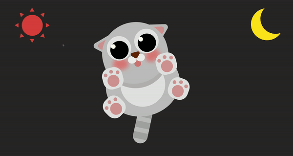
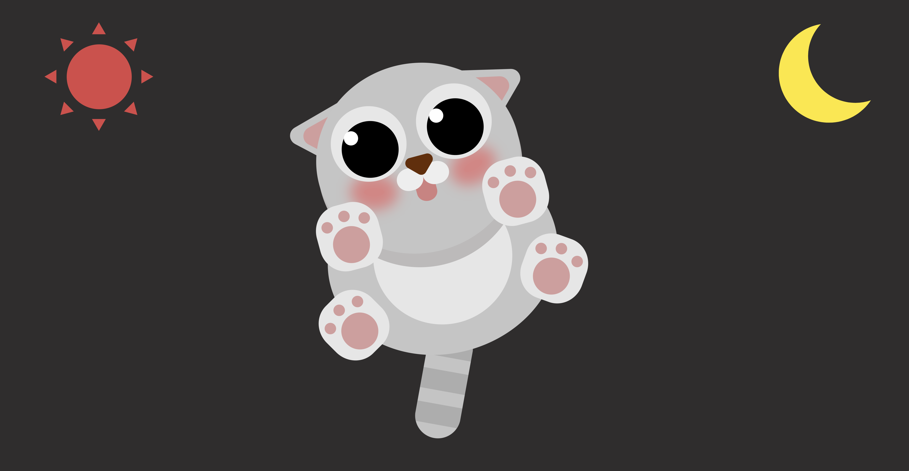
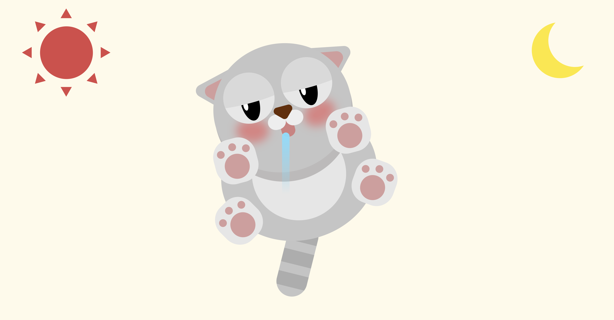

멋쟁이사자처럼 프론트엔드스쿨 2기, 천하제일 캐릭터 경진대회 출품작 입니다!

# LAZY CAT

항상 잠만 자는 우리집 고양이 몽구와 몽글이를 생각하면서 만들었습니다.

[link](https://usablepaper.github.io/character-animation/)

position: absolute;를 사용하여 레이아웃을 잡고,
CSS의 animation, @keyframes, :hover, java script를 사용하여 애니메이션을 구현하였습니다.
